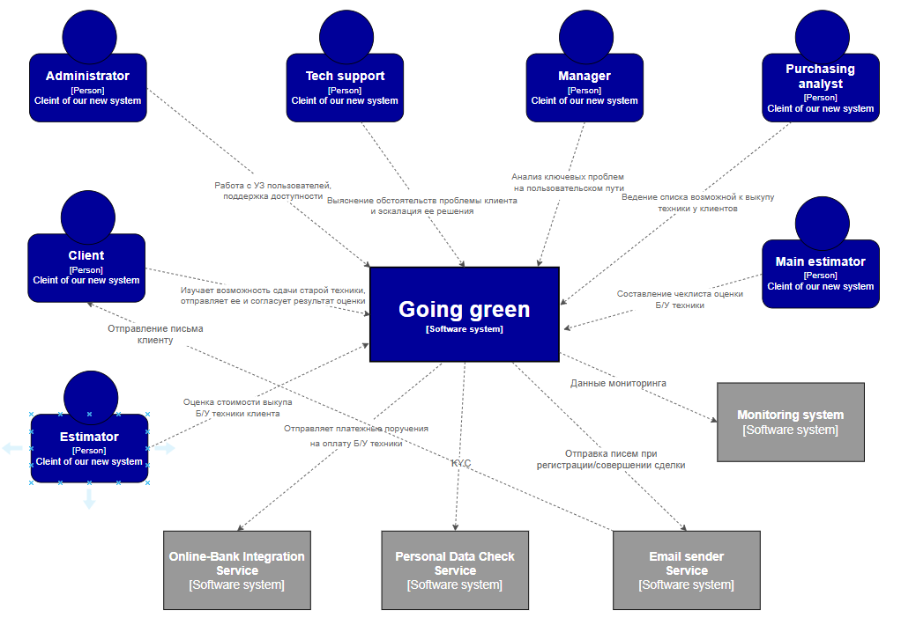

# Исходник задачи

_A large electronics store wants to get into the electronics recycling business and needs a new system to support it. Customers can send in their small personal electronic equipment (or use local kiosks at the mall) and possibly get money for their used equipment if it is in working condition._

_Users: Hundreds, hopefully thousands to millions
Requirements:
Customers can get a quote for used personal electronic equipment (phones, cameras, etc.) either through the web or a kiosk at a mall.
Customers will receive a box in the mail, send in their electronic, and if it is in good working order receive a check.
Once the equipment is received, it is assessed (inspected) to determine if it can be either recycled (destroyed safely) or sold (eBay, etc.).
The company anticipates adding 5-10 new types of electronic that they will accept each month.
Each type of electronic has its own set of rules for quoting and assessment.
Additional Context:
This is a highly competitive business and is a new line of business for us
If we haven’t received a type of electronic equipment in a year we will remove it from our system
We need to maintain a list of electronic equipment we are willing to accept as it changes often
Each piece of equipment has it’s own assessment (inspection) rules
We have the right to change the original quote to the customer if the product isn’t in the condition they said it was_

# Going Green

Большой магазин электроники хочет также развиться в новом для себя направлении - переработке/перепродаже электроники. У клиентов появится возможность в отправке небольших электрических приборов и получить за это денежное вознаграждение, если электрический прибор в рабочем состоянии.

## Бизнес-контекст

Магазин является крупным дистрибьютером товаров электроники, который имеет серьезную репутацию и давно на рынке. Магазин работает как в оффлайн так и в онлайн формате. С оффлайн форматом все понятно - клиент может прийти в любой магазин электроники сети, выбрать нужный ему товар и приобрести его. В онлайн-формате все также довольно стандартно, имеется онлайн-магазин с ассортиментом имеющегося товара, информация о его наличии, цене, отзывы клиентов и т.д. Технически система представляет собой большое модульное монолитное приложение, в целом у клиентов не часто возникают жалобы на сбои в его работе, поэтому компания на данный момент не сильно заинтересована в улучшениях текущего онлайн-магазина. Последнее время замечен активный рост интереса клиентов к переработанной электронике, как на сдачу своих старых электронных устройств, так и вопросы в КЦ в возможности приобретения Б/У техники с гарантией (ранее запускали акции по Trade-In). 
В связи с такими показателями заинтересованности клиентов магазина появилось желание в реализации новой системы для покупки Б/У электронных приборов у клиентов путем отправки клиентом данного устройства по почте или сдачи его в один из магазинов сети.


## Бизнес-драйверы и бизнес-цель

### Бизнес-драйверы

- Рост популярности "перепродажи" рабочей Б/У техники;
- Создание нового направления развития компании;

### Бизнес-цель

Создание новой высокопроизводительной и масштабируемой(компания надеется на большой поток клиентов) системы поддержки переработки/перепродажи электронных приборов. Дать возможность клиентам сети участвовать в программе сдачи своей Б/У электронной техники за денежное вознаграждение. Сервис должен давать возможность клиентам ознакомиться с перечнем товаров, принимаемых магазином, чеклистом проверок работоспособности. Денежные средства клиент получает после оценки предлагаемого к продаже товара оценочной комиссии путем банковского перевода от организации клиенту. Т.к. срок получения денежных средств зависит от внутрибанковских процессов и не может быть осуществлен "в моменте", то клиент получает на свой электронный адрес банковский чек. Система в перспективе должна расширить клиетский поток компании и привести к увеличению прибыли.

## Стейкхолдеры

- Клиент — человек, желающий сдать свою старую технику в обмен на денежное вознаграждение;
- Администратор — работа с УЗ пользователей, поддержка доступности и пр.;
- Служба поддержки — выяснение обстоятельств и устранение проблемы клиента;
- Менеджер — мониторинг ключевых технических проблем с возможностью сдачи техники;, оплаты за нее и т.д.;
- Оценщик — человек, оценивающий электронную технику в соотвтетсвии с заданными критериями оценки;
- Аналитик по закупкам — лицо, ведущее перечень возможных к покупке у клиента товаров электроники;
- Ведущий специалист оценки — человек, формирующий критерии приемки оценки товара;
- Команда разработки;

## Пользовательские истории

* US-1 — Регистрация клиента в системе. </br> - Клиент может успешно зарегистрироваться в системе, привязать необходимые реквизиты банковской карты для получения денег за отправленную технику;
* US-2 — Работа с перечнем возможной к приему Б/У техники;. </br> - Аналитик по закупке имеет доступ и возможность к расширению и редактированию базы возможных к приему Б/У товаров; </br> - Клиент может ознакомиться с перечнем типов возможных к приему Б/У товаров;
* US-3 — Формирование критериев приемки Б/У товара. <br/> - Ведущий специалист оценки может формировать и редактировать критерии приемки; <br/> - Оценщик при каждом изменении критериев оценки проинформирован об этом письмом/пуш-уведомлением;
* US-4 — Работа с клиентскими обращениями. <br/> - Клиент может обратиться с жалобой в некорректной оценке продаваемого товара; <br/> - Служба поддержки может отправить отклоненную заявку заново на специалистов-оценщиков с указанием недочетов оценки;
* US-5 — Сбор частых проблем системы. <br/> - Менеджер может ознакомиться с ключевыми проблемами системы, проведя анализ с помощью инструментов сбора статистики;
* US-6 — Согласование цены покупки. <br/> - Оценщик по результатам оценки определяет стоимость выкупа электронной техники и предложение падает в ЛК клиенту; </br> - Клиент в личном кабинете системы может согласиться или отказаться от выкупа его техники по оценочной цене; 
* US-7 — Оплата покупки Б/У техники клиенту сервиса. <br/> - Клиент, после согласия с предложенной ему ценой выкупа автоматически должен получать на электронный адрес чек-квитанцию с оплатой товара через онлайн-банкинг, таким образом клиент убедится, что оплата поступит к нему в течении некоторого времени;
* US-8 — Сбор обратной связи с клиентов, воспользовавшихся сервисом. </br> - Клиент, после согласия/отказа от предложенного ему денежного вознаграждения за сдачу Б/У техники может оценить сервис и оставить комментарий;
* US-9 — Ведение матрицы выкупленных единиц электронный техники. <br/> - Аналитик по закупкам может вести сводку выкупленных товаров, сколько из них удалось реализовать и вести рейтинг востребованности товара;
* US-10 — Прием техники в оффлайн-формате. </br> - Прием Б/У техники в оффлайн формате ничем не должен отличаться от процесса приемки в онлайн-формате за исключением способа передачи самой техники (почта/магазин сети);

## Базовые атрибуты качества и НФТ

* Регистрация клиентов и верификация персональных данных клиента (включая определения платежной системы карты, паспортных данных) не должна занимать более 10 секунд;
* Рабочее время оценщиков, при наличии такой возможности, должно быть обязательно занято заявкой на оценку;
* Время загрузки перечня возможных для сдачи товаров клиенту не должно превышать 2с. даже с учетом применения всех возможных фильтров;
* После получения согласия клиента на выкуп техники по оценочной стоимости клиенту в обязательном порядке должна прийти чек-квитация, без этого заявка не может быть переведена в конечный статус;

## Контекстная диаграмма


## Критические сценарии и критические характеристики

### Критические сценарии

* Регистрация новых клиентов сервиса;
* Получение клиентом перечня принимаемой техники и базовых критериев ее оценивания;
* Работа ведущего специалиста по оценке с перечнем Б/У электронных товаров;
* Рассылка чеков-квитанций на выкуп согласованной техники клиенту;
* Коррекная обработка очереди заявок на оценку в рамках каждого из оценщиков;
* Отображение информации о статусе оценки Б/У техники в ЛК клиентов;


### Критические характеристики

* Доступность перечней возможной к выкупу Б/У техники и критериев ее оценки;
* Доступность очереди заявок и ее равномерное распределение между оценщиками;
* Отсутствие зависших заявок;
* Оплата происходит только после согласования клиентом;
* Сложность внесения изменений/расширения перечня Б/У товаров;
* 95% квантелиь времени ответа сервисов для клиента не должно превышать 3с;
* Стоимость разработки;

## Архитектурное решение

**Контекст**: <br/> Необходимо создание системы на базе существующей компании (большого магазина электроники) по заведению и сопровождению заявки продажи Б/У электронной техники магазину. <br/>
У магазина электроники уже существует полноценный интернет магазин со всем стандартным функционалом. Бизнес нуждается в создании нового направления, покупка старой техники клиентов за денежное вознаграждение. <br/>

К рассмотрению выдвинуты две альтернативы.

**Альтернативы** <br/>

* Альтернатива 1. Реализовать систему переработки (recycling) электроники в существующем онлайн-магазине;
* Альтернатива 2. Реализовать всю систему полностью с нуля, используя самый свежий стек технологий.

**Оценка и сравнительный анализ**

На данный момент количество пользователей онлайн-магазина относительно велико > 100000. В процессе эксплуатации онлайн-магазина у пользователей не возникает частых обращений касательно производительности системы, у команды разработки отсутствует неопределенность в действующих бизнес-процессах системы. Онлайн-магазин представляет собой модульный монолит.<br/>
Б**о**льшая часть необходимого функционала онлайн магазина (регистрация, проверка персональных данных, интеграции с SMTP сервером рассылки писем, интеграция с онлайн-банкингом для оплаты) уже реализовано внутри онлайн-магазина. Его модульность позволяет переиспользовать этот функционал без дублирования. Целесообразным решением в данной ситуации будет создание новых модулей в текущем монолите и их интеграция с готовым функционалом. Более того, нашим текущим клиентам не нужно будет регистрироваться в новой системе, т.к. все необходимое для работы с новом функционалом у нас уже есть. В случае, если мы когда-то захотим вынести наши модули в отдельную систему, в силу соблюдения модульности монолита мы без проблем сможем вынести решение в микросервисную архитектуру.
В результате сравнительного анализа принято решение ипользовать в качестве базового решения Альтернативу 1.


# ADR

#Date

22.04.2022

# Title
Создание системы recycling электронной техники

## Status

```diff
Proposed
```

## Context

Большой магазин электроники хочет также развиться в новом для себя направлении - переработке/перепродаже электроники. У клиентов появится возможность в отправке небольших электрических приборов и получить за это денежное вознаграждение, если электрический прибор в рабочем состоянии.

## Decision

Cоздание новых модулей в текущем монолите и их интеграция с готовым функционалом.

## Consequences

Выбор стоял между двумя принципиально различными подходами к реализации системы по переработке/перепродаже электроники. Первый подход заключался в создании новых модулей внутри текущего модульного монолита онлайн-магазина, второй подход в создании микросервисной архитектуры полностью отдельной от онлайн-магазина системы. Было принято решение в реализации первого подхода, так как на данный момент это позволит нам гораздо быстрее вывести на рынок наш продукт, т.к. множество фкнционала будет переиспользовано из онлайн-магазина, в то же время, модульность решения позволит нам, в случае необходимости, вынести нашу систему recycling электроники в отдельную систему на микросервисной архитектуре.