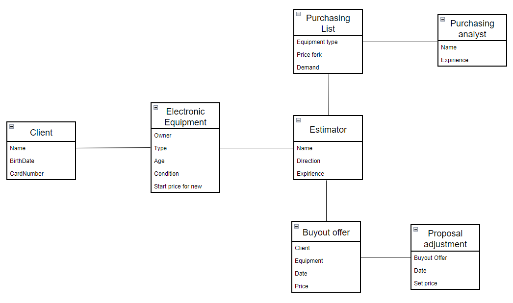

# Домашнее задание 2. Декомпозиция на функциональные компоненты.

## Описание задачи

С описанием задачи можно ознакомиться по предыдущей выполненной [работе](../HomeWork1/README.md).

## Выделение моделей предметной области

Выделено 7 ключевых моделей предметной области.

### Client

Клиент - человек, желающий сдать свою Б/У технику за денежное вознаграждение.

* Name - имя
* BirthDate - дата рождения
* CardNumber - номер карты, на которую клиент ожидает поступление денежных средств

### Electronic equipment

Электрический прибор - устройство, которое клиент хочет сдать
