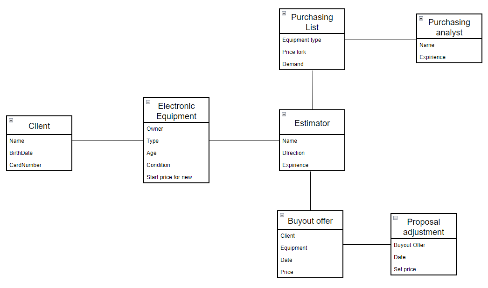
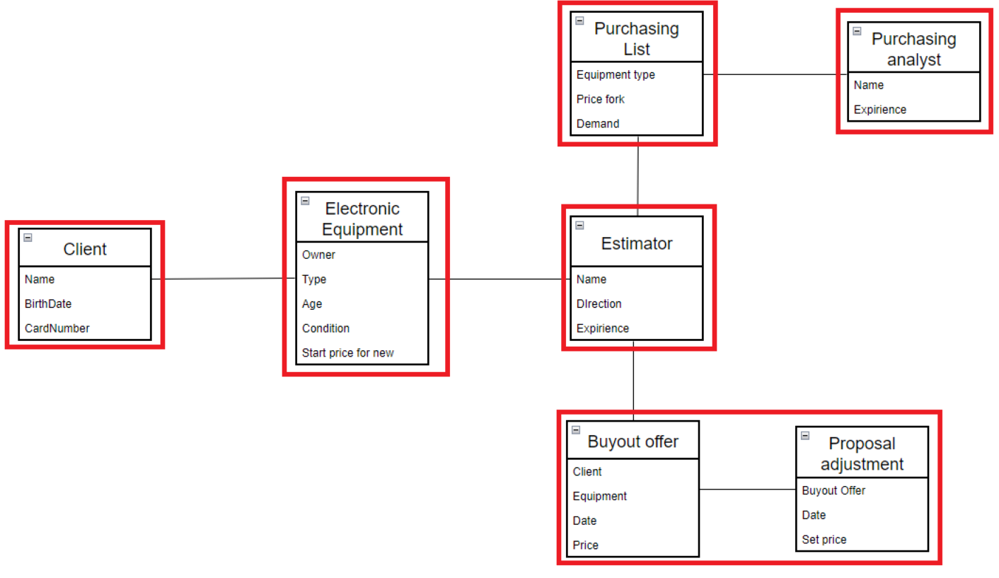
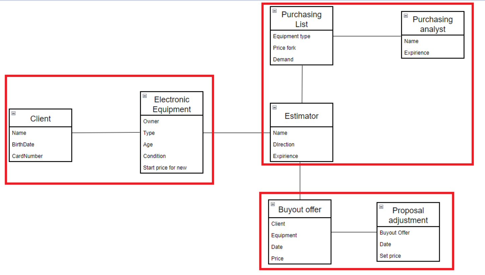

# Домашнее задание 2. Декомпозиция на функциональные компоненты.

## Описание задачи

С описанием задачи можно ознакомиться по предыдущей выполненной [работе](../HomeWork1/README.md).

## Выделение моделей предметной области

Выделено 7 ключевых моделей предметной области.

### Client

Клиент - человек, желающий сдать свою Б/У технику за денежное вознаграждение.

* Name - имя
* BirthDate - дата рождения
* CardNumber - номер карты, на которую клиент ожидает поступление денежных средств

### Electronic equipment

Электрический прибор - устройство, которое клиент хочет сдать

* Owner - владелец устройства
* Type - тип прибора
* Age - возраст прибора
* Condition - состояние
* Start price for new - стартовая цена за такой же новый

### Estimator

Оценщик - человек, кто занимается оценкой поступивших электрических приборов

* Name - имя
* Direction - направление(типы устройств), которые может оценивать специалист
* Expirience - опыт

### Purchasing List

Справочник закупок - справочник, который постоянно обновляется и пополняется, содержаший список электрических приборов и информацию о них, помогаюшую оценщику произвести корректную оценку и принять решение о выкупе.

* Equipment type - тип техники
* Price fork - вилка цен
* Demand - спрос

### Purchasing analyst

Аналитик закупок - человек, который мониторит рынок устройств, пополняет и обновляет справочник закупок

* Name - имя
* Expirience - опыт

### Buyout offer

Предложение о выкупе - оценщик вправе предложить клиенту предложение о выкупе.

* Client - клиент, сдавший технику на оценку
* Equipment - техника, которую сдал клиент
* Date - дата предложения
* Price - цена за выкуп

### Proposal adjustment

Корректировка предложения - Оценщик вправе скорректировать ранее данную оценку (которая не была ранее подтверждена клиентом)

* Buyout offer - предложение о выкупе
* Date - дата корректировки
* Set price - скорректированная цена

## Функциональная декомпозиция

Можем привести две функциональные декомпозиции.

### Декомпозиция по сущностям и агрегатам (вариант 1)

В этом случае мы выделяем следующие сущности/агрегаты:

* Клиент
* Электронный прибор
* Оценщик
* Справочник закупок
* Аналитик по закупкам
* Предложение о выкупе совместо с корректировкой

То есть функциональная декомпозиция относительно модели предметной области примерно такая:

### Декомпозиция по бизнес процессам

Следует выделить три ключевых бизнес-процесса системы:

* Сдача техники клиентом
* Оценка полученной техники
* Формирование предложения о выкупе

Таким образом, в этом случае функциональная декомпозиция относительно модели предметной области:

