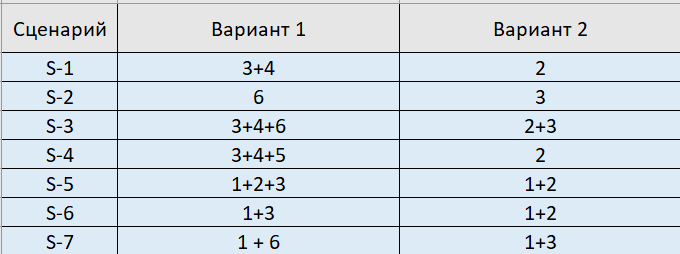

# Домашнее задание 2. Декомпозиция на функциональные компоненты.

## Описание задачи

С описанием задачи можно ознакомиться по предыдущей выполненной [работе](../HomeWork1/README.md).

## Выделение моделей предметной области

Выделено 7 ключевых моделей предметной области.

### Client

Клиент - человек, желающий сдать свою Б/У технику за денежное вознаграждение.

* Name - имя
* BirthDate - дата рождения
* CardNumber - номер карты, на которую клиент ожидает поступление денежных средств

### Electronic equipment

Электрический прибор - устройство, которое клиент хочет сдать

* Owner - владелец устройства
* Type - тип прибора
* Age - возраст прибора
* Condition - состояние
* Start price for new - стартовая цена за такой же новый

### Estimator

Оценщик - человек, кто занимается оценкой поступивших электрических приборов

* Name - имя
* Direction - направление(типы устройств), которые может оценивать специалист
* Expirience - опыт

### Purchasing List

Справочник закупок - справочник, который постоянно обновляется и пополняется, содержаший список электрических приборов и информацию о них, помогаюшую оценщику произвести корректную оценку и принять решение о выкупе.

* Equipment type - тип техники
* Price fork - вилка цен
* Demand - спрос

### Purchasing analyst

Аналитик закупок - человек, который мониторит рынок устройств, пополняет и обновляет справочник закупок

* Name - имя
* Expirience - опыт

### Buyout offer

Предложение о выкупе - оценщик вправе предложить клиенту предложение о выкупе.

* Client - клиент, сдавший технику на оценку
* Equipment - техника, которую сдал клиент
* Date - дата предложения
* Price - цена за выкуп

### Proposal adjustment

Корректировка предложения - Оценщик вправе скорректировать ранее данную оценку (которая не была ранее подтверждена клиентом)

* Buyout offer - предложение о выкупе
* Date - дата корректировки
* Set price - скорректированная цена

## Функциональная декомпозиция

Можем привести две функциональные декомпозиции.

### Декомпозиция по сущностям и агрегатам (вариант 1)

В этом случае мы выделяем следующие сущности/агрегаты:

1) Клиент 
2) Электронный прибор 
3) Оценщик 
4) Справочник закупок 
5) Аналитик по закупкам 
6) Предложение о выкупе совместо с корректировкой

То есть функциональная декомпозиция относительно модели предметной области примерно такая:

### Декомпозиция по бизнес процессам

Следует выделить три ключевых бизнес-процесса системы:

1) Сдача техники клиентом 
2) Оценка полученной техники 
3) Формирование предложения о выкупе

Таким образом, в этом случае функциональная декомпозиция относительно модели предметной области:

## Оценка решений по модифицируемости

### Формирование сценариев изменений/улучшений по приоритету (от наивысшего к наинизшему)

* S-1 - Отправка клинту предложения, сформированного оценщиком может быть сделана только после согласования аналитика по закупкам.
* S-2 - Клиент может торговаться с "свою" сторону относительно выставленного предложения о выкупе.
* S-3 - Автоматическая блокировка несогласованных предложений с клиентом в случае резкого спада спроса на данный тип электронных приборов.
* S-4 - По всем уже сформированным, но еще не согласованным с клиентом предложениям, оценщик должен получать уведомления об обновлении данных справочника закупок, чтобы мог оперативно корректировать свое предложение.
* S-5 - Оценщик по своим вопросам может создать в системе чат с клиентом в рамках обсуждения электрического прибора и оставлять комментарий о нем.
* S-6 - Клиент может раз в два дня нажимать на колокольчик, сигнализирующий о том, чтобы его заявку рассмотрели как можно скорее и произвели оценку.
* S-7 - У клиента может формироваться рейтинг в зависимости от количества и качетсва сданных электрических приборов, на основании которых для него могут быть сформированы более выгодные предложения.

### Оценка стоимости изменений

Для каждого сценария изменений оценили, какие изменения какие модули затронут:

## Вывод из оценки

Можно сделать вывод, что в случае функциональной декомпозиции по варианту 2 мы не получим слишком много согласованных изменений, большую и приоритетную часть из них можно реализовать в рамках одного модуля. Декомпозиция системы и проектирование микросервисов "по сущностям" кажется здесь менее применимым и целесообразным.