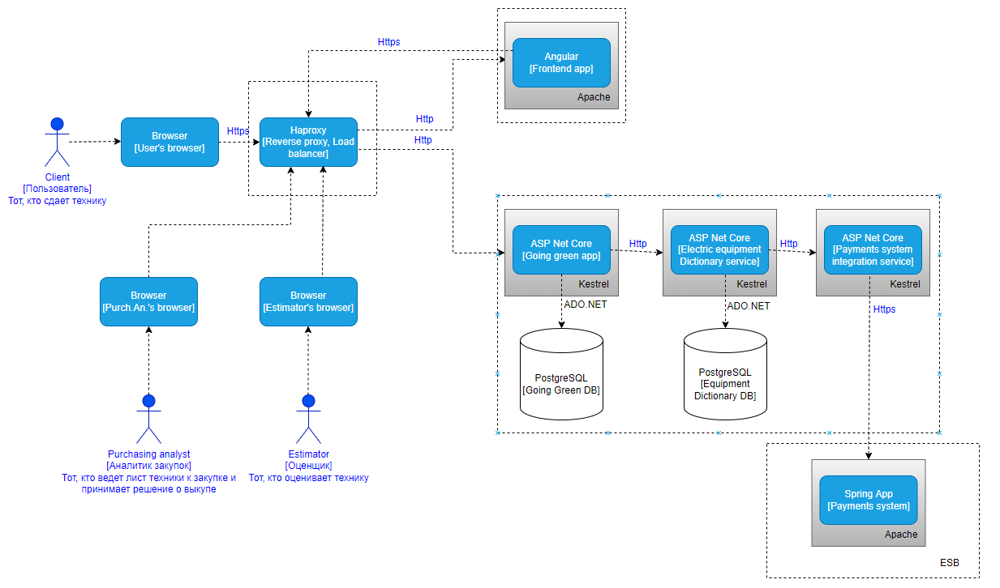
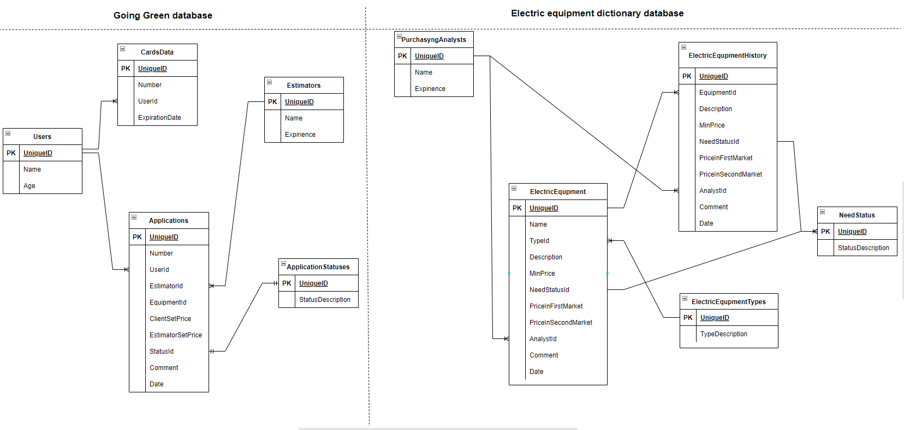
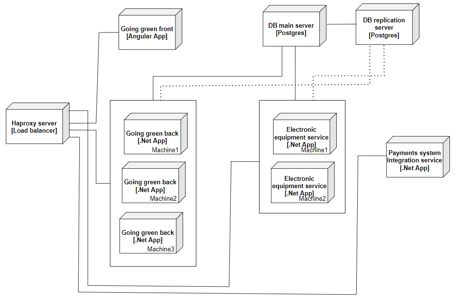

# Домашнее задание 3. Системное проектирование.

## Описание кейса

С описанием кейса можно ознакомиться по первой выполненной [работе](../HomeWork1/README.md).

## Контейнер-диаграмма

## Декомпозиция слоя данных

## Деплоймент диаграмма

