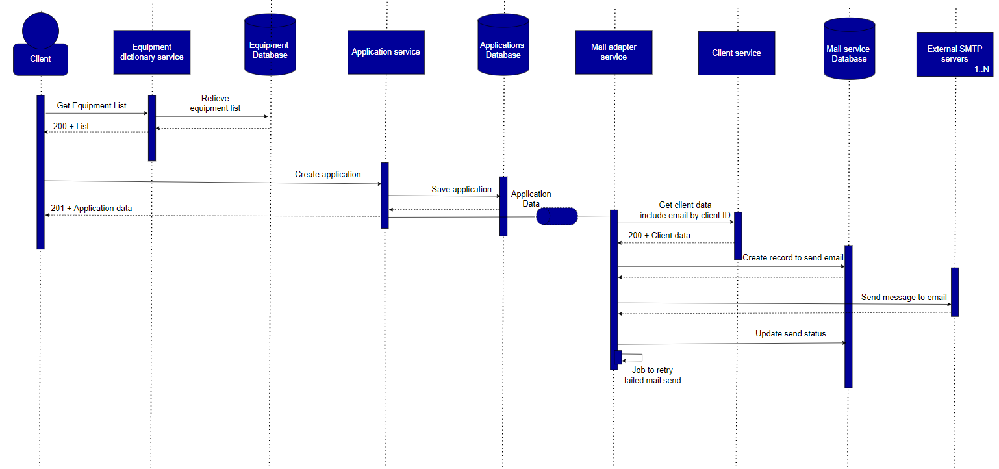
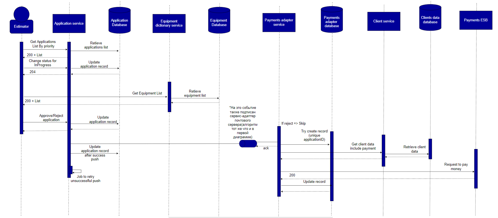

# Домашнее задание 5. Взаимодействие сервисов

## Критические сценарии

Выделим два ключевых сценария, для которых построим Sequence-диаграммы и произведем оценку атрибутов качества:

1) Клиент GoingGreen может завести заявку на сдачу Б/У техники с указанием стоимости сдачи, по возможности заранее ознакомившись с перечнем принимаемой в данный момент техники с пониманием о средней цене выкупа.
2) Оценщик может взять в оценку и произвести техническую оценку Б/У техники и в соответствии с данными по справочнику сформировать заключение о выкупе и отправить клиенту денежные средства.

### Сценарий 1

В данном сценарии стоит обратить внимание, что первый запрос клиента к сервису справочнику техники не является критично важным с точки зрения бизнес-процесса. Данный запрос носит для него информационный характер и в целом поможет определиться, стоит ли ему дальше оформлять заявку на сдачу техники. Т.е. если данный запрос не вернул по какой-то причине результата, то он не должен ломать сценарий создания заявки. Клиент без проблем может продолжить заполнять форму заявки и отправить ее. По завершении заполнения заявки пользователь ее отправляет и она сохраняется в синхронном режиме, т.е. пользователь в режиме реального времени получит ответ об успешности заведения заявки на сдачу Б/У техники.

Перед тем, как отправить ответ пользователю о том, что мы успешно завели заявку на сдачу техники, система публикует об этом событие в брокер сообщений.

На данное событие подписан сервис-адаптер интеграции с почтовым сервером для взаимодействия с клиентами через электронную почту. По получению события сервис в синхронном режиме идет за данными в сервис данных о клиенте и после этого сохраняет данные о нем. После сохранения мы можем ack-нуть событие, т.к. все необъодимые для обработки данные мы уже записали. Далее мы пытаемся отправить сообщение в синхронном режиме и в случае успеха - обновить статус. Весь функционал отправки выделен также в периодическую задачу, чтобы в случае ошибки при интеграции с почтовым сервером, мы могли заретраить отправку. 

Еще раз хочется сделать акцент на том, что основное в сценарии - что клиент смог завести заявку и видит в результате ее успешное создание. Наличие в целом а также скорость доставки информации об этом на почтовый адрес клиента не является критичной частью функционала системы.

#### Оценка по отказоустойчивости

Доступность для клиента определяется A(Application service) * A(Application database)

То есть для клиента критична стабильность работы сервиса Application и БД этого сервиса.

Время определения проблемы клиента также заключается в анализе проблем данных сервисов.

Явных проблем с отказоустойчивостью не наблюдается.

#### Оценка по модифицируемости

Основной сценарий изменения, как видится, может затрагивать структуру самой заявки, и при такой декомпозиции и взаимодейтсвии сервисов не наблюдается "размазывание" этой сущности по разным сервисам, соответственно изменять придется только в одном месте.

Больших сложностей с модифицируемостью не выявлено.

#### Производительность

Ожидается, что в пике система должна выдержвить 100 rps на данный момент. Т.к. сервисы по сути представляют собой простые CRUD-ы, то проблем с производительностью не замечено.

#### Масштабируемость

Теоретически, будем надеяться, может увеличиться кол-во клиентов и количество заявок. Объем запросов и данных не должен оказать критического влияния, т.к. все операции работают на insert, который не будет слишком замедляться. Не исключаю горизонтального и вертикального масштабирования БД, сервиса заявок.

### Сценарий 2

В данном сценарии важно, что оценщик сначала должен получить список приоритезированных заявок, взять заявку с высоким приоритетом и обновить ей статус, чтобы клиент в ЛК мог понять, что заявка находится в работе. Также оценщик не может (не имеет права по инструкции) произвести оценку без получения актуальной информации из сервиса справочника техники. По результатам оценки, оценщик должен согласовать/отклонить сделку. В случае согласования - клиент (обязательно) в течении одного рабочего дня должен получить деньги на привязанную в ЛК карту (данные для оплаты храняться в сервисе клиентов) и очень желательно получить информацию о согласованной сделке на почтовый адрес.
Из схемы убрал процесс с отправкой письма на электронный адрес, алгоритм тот же, что описан в сценарии 1.

Оценщик получит результат своей операции гарантировано только тогда, когда заявка примет корректный статус, таким образом мы гарантировано сохранили все данные внутри сервиса, чтобы без ручного вмешательства мы смогли протолкуть оплату заново (в случае падения очереди).

Сервис-адаптер взаимодействия с шиной платежей забирает событие о результате оценки и по флажку решает, что делать: если заявка отклонена, то сервис просто ack-ает данное событие. В случае, если заявка согласована, тогда сервис пытается сохранить в свою БД все данные, по которым он может идентифицировать человека, кому он должен отправить деньги, даже в случае падения. (В БД у нас ограничение по уникальности ApplicationId, чтобы ни в коем случае у нас не было двойной оплаты по одной заявке). Далее сервис запрашивает необходимые данные для оплаты (номер карты и иные реквизиты) у сервиса клиентских данных в синхронном режиме, и следующим запросом на корпоративную шину Payments отправляет деньги клиенту. В случае успеха/неуспеха статус обновляется на нужной в БД, это в дальнейшем поможет джобе определить клиентов, кому не получилось отправить деньги.

#### Отказоустойчивость

В данном случае доступность функционала оценки (необходимый для работы оценщика) заключается в доступности сервиса заявок, базы данных заявок, сервиса справочника техники, базы данных справочника техники, очереди сообщений (перед тем как ответить оценщику, мы обязательно должны опубликовать событие, т.к. иначе мы можем потерять оплату).

То есть А(Application service) * А(Application DB) * А(Equipment service) * А(Equipment DB) * А(Queue)

Не могу назвать такое решение отказоустойчивым, выход из строя любого из компонентов выше приведет к отказу возможности произведения оценки.

#### Оценка по модифицируемости

В целом решение вполне модифицируемо.

#### Производительность

Решение довольно производительно, нет долгих вычислительных операций, различных интеграций, агрегаций данных и прочего (хотя выгрузка данных из сервиса справочника при каждой оценке) довольно емкая штука, может быть стоит перейти на обновляемый кеш (нужно подумать).

#### Масштабируемость

В целом, по необходимости можем масштабировать каждый компонент системы как вертикально, так и горизонтально.
